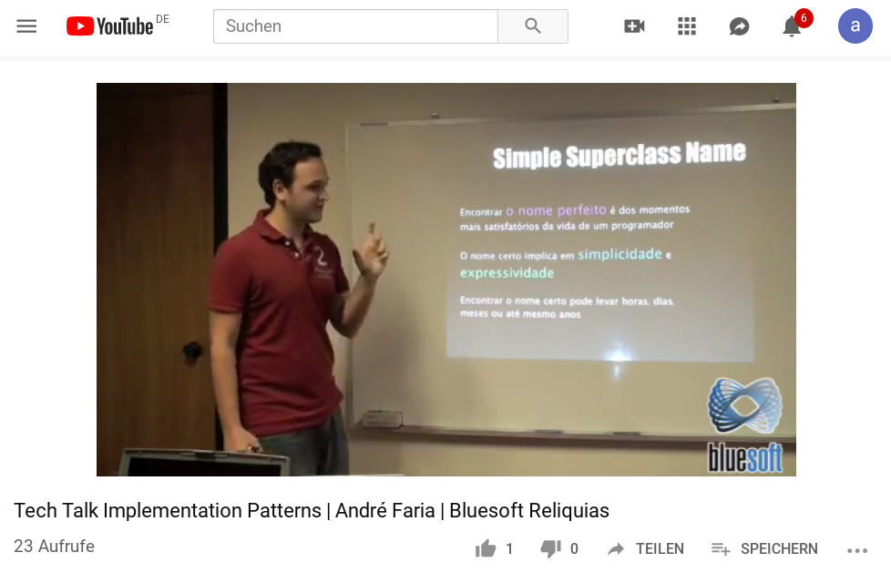
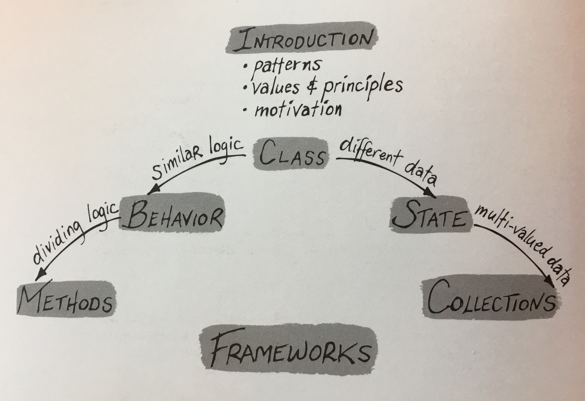

## Implementation Patterns
**Dr. Frank Gerhardt**

03.07.2019


<!-- .slide: data-background="./Implementation-Patterns-Korsika.jpg" -->


## Dr. Frank Gerhardt
- Smalltalker, LISP-Lover, Emacs
  - auch Java, Eclipse, neuerdings JS, Python
- Gründer und 1. Erster Vorsitzender der JUGS
  - erster JFS-Organisator 
- Software Experts Network Stuttgart e.V.
  - **nachher am Stand**
- Gerhardt Informatik, 10 Mitarbeiter
- we're not hiring, kein Gewinnspiel ;-)
- freie Kapazitäten ab September

<!--
SW archaeology, Steinplatten

schools: formal spec+transformation, MDA, top down

TODO Foto

TODO use green

Words inspired by c2: YAGNI DSSTTCPW design carry, code smell

my holiday reading

TODO the art of writing is re-writing

-->


## Abstract

<p align="left" style="font-size:80%;" >
Implementation Patterns ist ein leider in Vergessenheit
geratenes Buch von Kent Beck aus dem Jahr 2007. Diese Patterns,
auch Idiome genannt, sind unterhalb von Design Patterns aber
oberhalb von Code-Formatierungsregeln angesiedelt. Bei den
Implementation Patterns geht es darum wie man einzelne Klassen und
Methoden gestaltet. In Code Reviews bin ich immer wieder auf Fälle
gestoßen, bei denen schlechter Code auf Unkenntnis der
Implemenation Patterns zurück geführt werden kann. Anfänger und
Fortgeschrittene können die Qualität ihres Codes wesentlich
verbessern, wenn sie die Implementation Pattern kennen und
anwenden.
</p>


## Why?
- I have two copies of "Implementation Patterns"
  - people don't read books
- I read a lot more code nowadays
  - reviewing is coaching
  - I explain these patterns again and again
- I need this presentation for my team
  - there was no talk on YouTube


## Spanish Talk
<!--
<iframe width="640" height="360" src="https://www.youtube.com/embed/y82xz547zs8" frameborder="0" allow="accelerometer; autoplay; encrypted-media; gyroscope; picture-in-picture" allowfullscreen></iframe>
-->


https://www.youtube.com/watch?v=y82xz547zs8


## Kent Beck
- SUnit -> JUnit -> xUnit
- Ward and Kent, c2.com Wiki
- talk at JUGS 1998
  - going out to Cannstatter Wasen


<!-- .slide: data-background="./jugs-1998.png" -->


## Design Patterns
Gang of Four, 1994, using C++

 
<!-- Design Patterns for Dummies 
-->


## XP
eXtreme Programming, 1999, 2nd ed. 2004


## Refactoring
1999, 2nd ed. 2019

 


## Agile Manifesto
- 2001
- **values** and **principles**
- Kent **B**eck is first signer 
  - thanks to alphabetical order


## TDD
Test-Driven Development, 2002


## About the Book
- first as Smalltalk book, 1996
- then Java, when JUnit 4 was new, 2008
- 77 patterns, 157 pages
  - in 45 minutes!? Nope.

 


## Tour Guide
- How to read the Book?
- Kent writes
  - read just in time
  - use patterns every few seconds
- First, browse content to know what's in there
- Read ch. "A Theory of Programming" first, it's great
<!--
read the book
desk reference
2nd nature
"Projektsprache"
personal style
 
TODO add code example for nested conditionals

TODO is there an errata?
e.g. field roles, "plain data" is missing IMHO


examples from JUnit 4

Hey, which books have a theory section and a philosophy appendix!?

refers to Christopher Alexander

TODO how to write unmaintainable code

TODO using syntax highlighting, no types in names

TODO Kafka: alles umbenennen

TODO think about the debugger + stack traces
- need to work with code when error happens
- under stress

TODO beginner style: yet another level of if

-->
<!-- 
## Structure

-->


## Motivation


## Assumption, Premise

> Good code matters.

Most of the time, not always.


## Goal
- don't program by instinct
  - explainable, why?
- importance of other people
  - the other's perspective
  - programming so that other people can understand your code
  - consciously for others as well as for yourself


## Jeopardy
- Answer: A word describing being thrown out of a window <!-- .element: class="fragment" -->
- Question: What is defenestration? <!-- .element: class="fragment" -->
- Coding is like Jeopardy <!-- .element: class="fragment" -->
- Answer: your Java code <!-- .element: class="fragment" -->
- Question: what was the question? <!-- .element: class="fragment" -->
- E.g. a field declared as a Set means... <!-- .element: class="fragment" -->


## "Theory"


## "Laws"
- code is more often read than written
- there is no "done"
- basic set of control flow concepts (sequence, branch, loop, call)
- path of understanding
  - detail-to-concept
  - concept-to-detail
- the patterns are not general
  - adapt to personal style


## Values and Principles
- 3 values
- 6 principles


## Values
- communication
- simplicity
- flexibility


## 1. Communication
- with other people
- literate programming
  - nice: Jupyter notebooks
- the other's perspective


## 2. Simplicity
- remove excess complexity
- in the eye of the beholder
- have audience in mind
- waves of complexity and simplification


## 3. Flexibility
- keep options open
- misused? speculative?

<!--
TODO naming
CamelCase, under_scores, lisp-style should go into style guide
-->


## Principles
- local consequences
- minimize repetition
- logic and data together
- symmetry
- declarative expression
- rate of change (temporal symmetry)


## Cost 
- initial
- maintenance
  - understanding
  -  changing
  - testing
  - deploying


## Patterns Overview
- Class (18): data and logic together
- State (19): different data
- Behavior (14): similar logic
- Methods (24): dividing logic
- Collections: multi-valued data
- Frameworks

Note: only 75 pattern here, 77 claimed on back cover, 89 in index


<!-- .slide: data-background="./structure.jpg" -->


## Class Patterns 

**Class**
Simple Superclass Name
**Qualified Subclass Name** 
Abstract Interface
**Interface**
Abstract Class
**Versioned Interface**
Value Object
**Specialization**
Subclass
**Implementor**
Inner Class
**Instance-Specific Behavior**
Conditional
**Delegation**
Pluggable Selector
**Anonymous Inner Class**
Library Class

Note: (ch. 5)


## State Patterns 
State
**Access**
Direct Access
**Indirect Access**
Common State
**Variable State**
Extrinsic State
**Variable**
Local Variable
**Field**
Parameter
**Collecting Parameter**
Optional Parameter
**Var Args**
Parameter Object
**Constant**
Role-Suggesting Name
**Declared Type**
Initialization
**Eager Initialization**
Lazy Initialization

Note: (ch. 6)


## Behavior Patterns
Control Flow
**Main Flow**
Message
**Choosing Message**
Double Dispatch
**Decomposing (Sequencing) Message**
Reversing Message
**Inviting Message**
Explaining Message
**Exceptional Flow**
Guard Clause
**Exception**
Checked Exceptions
**Exception Propagation**

Note: Chapter 7: 


## Methods Patterns

**Composed Method**
Intention-Revealing Name
**Method Visibility**
Method Object
**Overridden Method**
Overloaded Method
**Method Return Type**
Method Comment
**Helper Method**
Debug Print Method
**Conversion**
Conversion Method
**Conversion Constructor**
Creation
**Complete Constructor**
Factory Method
**Internal Factory**
Collection Accessor Method
**Boolean Setting Method**
Query Method
**Equality Method**
Getting Method
**Setting Method**
Safe Copy

Note: Chapter 8: 


## Collections Patterns
- Metaphors, Issues
- Interfaces
  - **Array** Iterable **Collection** List **Set** SortedSet
    **Map**
- Implementations
  - **Collection** List **Set** Map **Collections** Searching
    **Sorting** Unmodifiable Collections **Single-Element
    Collections** Empty Collections **Extending Collections**

Note: Chapter 9: 


## Evolving Frameworks
- Changing Frameworks without Changing Applications
- Incompatible Upgrades
- Encouraging Compatible Change
- Library Class
- Objects


## Class Patterns (18)


### Class
- data changes for often than logic
- expensive
- reduce number


### Simple Superclass Name
- the super class name is the most important name
- operation follow after the class name, not reverse
- tension long or short?
- pick strong metaphor
- a few single words
- use a thesaurus
- go for a walk


### Qualified Subclass Name
- one word would be best
- express how is the subclass
  - similar
  - different
- multi-level hierarchies are generally delegation waiting to happen
- too short names burden the developers' short term memory


### Abstract Interface
- each interface has a cost
  - one more thing to learn, understand, document, debug, organize,
    browse, and name
- can cause inflexibility
- there are limits to the value of "future-proofing" software
  through speculation
- Putting all these factors together - the need for flexibility,
  the cost of flexibility, the unpredictability of where
  flexibility is needed - leads me to the belief that the time to
  introduce flexibility is when it is definitely needed.


### Interface 
- named like classes
- names already used up by classes
  - ISomething is fine, see Eclipse
  - SomeImpl is a bit ugly
- changes to interfaces are discouraged


### Abstract Class
- a mix of interface and class


### Versioned Interface
- OK if not too many
- see Eclipse
  - ISomething, ISomething2, ISomething3
- `instanceOf` 


### Value Object
- set all fields in constructor
- always return new objects
- whenever possible create microworlds of math


### Specialization
- extremes
  - same logic, different data
  - different logic, same data


### Subclass
- can play this card only once :-/
- static, can not change at runtime
  - delegation can
- methods should do one job
  - to not have to copy from super class
- avoid parallel hierarchies


### Implementor
- polymorphic messages
  - to different receivers
  - for parameters see *overloading*
- to express choice
- open a system to variation


### Inner Class
- when nobody outside needs to know


### Instance-Specific Behavior
- static
- dynamic


### Conditional
- or maybe better
  - subclass
  - delegation


### Delegation
- pass delegator as a parameter
- store in a field
- or calculated


### Pluggable Selector
- call with reflection
- store name in field


### Anonymous Inner Class
- alternative way to implement *instance-specific behavior*
- override one or more methods for specific behavior
- more static that delegation
- difficult to test


### Library Class
- start with static methods
- try instances
- maybe evolve to a real class


## State Patterns (19)


### State
- state is not only bad
  - functional programming not yet popular
  - single assignment
  - variable-less programming
- state is valuable


### Access
- accessing values
- invoking computations


### Direct Access
- "most of my thoughts have nothing to do with storage"


### Indirect Access
- cache
- listeners


### Common State
- used in one operation only?
- used at one time only?
- what operations have to work on the state?
- what is the lifetime of the state?


### Variable State
- use a map


### Extrinsic State
- e.g. persistence
- identity map
  - the state is stored elsewhere


### Variable
- not much to say


### Local Variable
- use simple names
- should have same lifetime and scope
  - "siblings"


### Field
- consider final
- roles 
  - helper
  - flag
  - strategy
  - state
  - components


### Parameter
- preferable to static fields
  - coupling
- weaker coupling than permanent reference


### Collecting Parameter
- use one parameter as a "basket" to collect results


### Optional Parameter
- e.g. creating a `Socket`
  - with few or more parameters
  - "telescoping" 


### Var Args
- use varargs to pass a variable number of arguments instead of a collection


### Parameter Object
- group many parameters in its own object


### Constant
- store state that doesn't vary as a constant


### Role-Suggesting Name
- short names
- no type info in name
- no "l" for local, like lCount, or "f" for field
- reuse common names
  - result
  - each
  - count
- saving letters with 1-letter names is false economy


### Declared Type
- List or Collection, think about promises you make
- be pessimistic ;-)
- allow as litte information as possible to spread as narrowly as
  possible
- communicate the use
  - not in variable name, e.g. `uniqueBooks`
  - rather `Set<Book>`


### Initialization
- initialize variables declaratively as much as possible


### Eager Initialization
- initialize fields at instance creation time


### Lazy Initialization
- initialize fields whose values are expensive to calculate just
  before they are first used


## Behavior Patterns (18)
- history: all based on the concept of the **instruction**
  - by Neumann János Lajos, from Budapest, aka [John von
    Neumann](https://en.wikipedia.org/wiki/John_von_Neumann)
- later: the **expression**
  - the LISP school


### Control Flow
- sequence
- conditional
- loops
- groupings
  - in class
  - delgating
- levels of abstraction


### Main Flow
- happy day, or hostile environment?
- focus on main flow, make seldom executed corner cases less
  prominent
- use exceptions to keep main flow clean
  - main exception handler
  - consider coupling and dependencies


### Message
- all about **change**
  - receiver will be changed
  - sender will not be changed
- ```Java
  compute() {
    input();
    process();
    output();
  }```
- no functions, no return values
- all in receiver, or side-effects


### Choosing Message
- vary the implementors of a message to express choices
- like a case statement
- ```Java
  public void displayShape(Shape subject, Brush brush) {
    brush.display(subject);
  }```
- implementation chosen by runtime type of brush


### Double Dispatch
- vary the implementors of messages along two axes to express
  cascading choices


### Decomposing (Sequencing) Message
- break complicated calculations into cohesive chunks


### Reversing Message
- Make control flow symmetric by sending a message that can be implemented in different ways


### Inviting Message
- invite future varation by seindin a message that can eb implemented in different ways
- aka hook


### Explaining Message
- send a message to explain the purpose of a clump of logic


### Exceptional Flow
- express the unusual flow of control as clearly as possible
  without interfering with the expression of the main flow


### Guard Clause
- express local exceptional flows by an early return
- IF/ELSE is equally important
  - do you want that?
- single entry, single exit
  - not so relevant any more today
- **nested conditionals breed defects**


### Exception
- express non-local exceptional flow with exceptions


### Checked Exceptions
- makes refactoring more difficult
- more cost
- risk of termination


### Exception Propagation
- wrap
- add detail


## Methods Patterns (24)
- the gigantic procedure, why not?
  - independent reuse
  - independent reading
- issues 
  - size
  - purpose
  - naming


### Composed Method
- compose methods our of calls to other mehods
- levels of abstraction<br/> 
  ```Java
  compute() {
    input();
    flags |= 0x0080;
    output();
  }```


### Intention-Revealing Name
- name methods after what they are inteded to do
- think about the calling side
- not: implementation detail


### Method Visibility
- make methods as private as possible
- private, final
- thik about responsibility


### Method Object
- turn complex methods into their own objects
- Kent's favourite

Note: TODO add steps 1.-6.


### Overridden Method
- override methods to express specializaiton
- abstract?
- invitaton
- final


### Overloaded Method
- provide alternative interfaces to the same computation
- different parameters
- number of parameters, carefully
- don't mess with return type


### Method Return Type
- declare the most general possible return type
- `void` implies side effects
  - in the receiver, or elsewhere
- distinguis procedures and functions
- use most abstract type
  - consider interface
  - expect changes


### Method Comment
- comment methods to communicate information not easily read from the code
- better: use names
- redundancy is waste
- even consider tests
  - e.g. for calling order of different methods
  - this after that


### Helper Method
- create small, private methods to express the main computation more succintly
- hide details in composed method


### Debug Print Method
- use `toString()` to print useful debugging information
- this is valuable
- for different audiences
- abuse: parse `toString()` output


### Conversion
- express the conversion of one type of object to another cleanly


### Conversion Method
- for simple, limited conversions, provide a method on the source
  object that returns the converted object
- use sparingly, not 20 times
- better: constructor, see next
- beware of dependency


### Conversion Constructor
- for most conversions, provide a method on the converted object's
  class that takes the source object as parameter
- don't pile up conversions in source object


### Creation
- express object creation clearly


### Complete Constructor
- write constructors that return fully formed objects


### Factory Method
- express more complex creation as a static method on a class
  rather than a constructor
- advantages
  - return different type
    - even interface
  - **can name after intention**


### Internal Factory
- encapsulate in a helper method object creation that may need
  explanation or later refinement


### Collection Accessor Method
- provide methods that allow limited access to collections
- an `iterator` is safe except for `remove()`
- example, next slide


```Java
  Interator<Book> getBooks() {
    final Iterator<Book> reader = books.iterator();
	return new Iterator<Book>() {
	  
	  public boolean hasNext() {
	    reaturn reader.hasNext();
	  }
	  
	  public Book next() {
	    return reader.next();
      }
	  
	  public void remove() {
	    throw new UnsupportedOperationException();
	  }
	};
  } ```


### Boolean Setting Method
- if it helps communication, provide two methods to set boolean
  values, one for each state<br/>
  ```Java
  void setState(boolean newState);
  
  void valid() { ...
  void invalid() { ...
  ```


### Query Method
- return boolean values with methods as `asXXX`
- prefix with a form of "be" or "has"
  - `isValid()`, `hasNext()`


### Equality Method
- define `equals()` and `hashCode()` together


### Getting Method
- occasionally provide access to fields with a method returning that field


### Setting Method
- even less frequently provide the ability to set fields with a method


### Safe Copy
- avoid aliasing errors by copying objects passed in or out of accessor methods
- better: immutable objects


## Wrap up


## Update needed?
- style, fashion
  - "he" not "she"
  - functional is underrated
- recent additions to Java not covered
  - interfaces, defaults
  - annotations
- patterns explained in "Hello, world!" context
  - not in real-world context
  - authorization, persistence, logging, concurrency


## Conclusion
- everything in the book is valid today
- worth reading also for non-Java developers
- pattern language to talk about your code
  - table of contents will be your most valuable pages
  - lists all the patterns conscisely


## Next
- buy the book, read it
- keep it on your desk
- don't expect colleagues to read it
  - it's a conversation
- establish patterns language in your team
  - when reviewing code, pull requests


<!-- .slide: data-background="#888888" -->
# The End.

* https://github.com/gerhardt-io/slides
- Software Experts Network Stuttgart e.V.
  - **nachher am Stand**
- we're not hiring, kein Gewinnspiel ;-)
- freie Kapazitäten ab September
